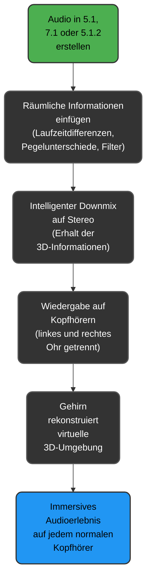

# Warum funktioniert 3D- oder Mehrkanal-Sound auch auf normalen Stereo-Kopfhörern?

## Kurze Antwort

Obwohl Kopfhörer lediglich zwei Kanäle (links und rechts) wiedergeben, interpretiert das menschliche Gehirn bestimmte akustische Hinweise so, als kämen Klänge aus allen Richtungen.  
Das **Audio Raytracing Studio** nutzt genau diese Prinzipien gezielt aus.

---

## Detaillierte Erklärung

### 1. Das menschliche Gehör "baut" den Raum im Kopf

Das menschliche Gehör ist darauf spezialisiert, aus kleinsten Unterschieden zwischen dem linken und rechten Ohr die Richtung einer Schallquelle zu bestimmen.  
Diese Unterschiede umfassen:

- **Laufzeitdifferenz (ITD)**: Welches Ohr erreicht der Schall zuerst?
- **Pegelunterschied (ILD)**: In welchem Ohr ist der Schall lauter?
- **Spektrale Filterung (HRTF)**: Wie verändert das Außenohr Frequenzen, je nach Richtung?

Beispiel:  
Kommt ein Ton leicht von links, erreicht er das linke Ohr minimal früher und etwas lauter. Das Gehirn berechnet daraus intuitiv die Richtung – auch bei Wiedergabe über Kopfhörer.

**Das Audio Raytracing Studio** generiert diese Unterschiede gezielt, sodass sie auf jedem normalen Kopfhörer wahrnehmbar bleiben.

---

### 2. Surround-Systeme erzeugen diese Hinweise natürlich

Das **Audio Raytracing Studio** erstellt Audiodaten in Formaten wie 5.1, 7.1 oder 5.1.2 (Atmos Light).  
Selbst nach einem intelligenten Downmix auf Stereo bleiben die wichtigsten räumlichen Informationen erhalten:

- **Zeitverzögerungen**  
- **Lautstärkeunterschiede**  
- **Frequenzfilterungen**

Beispiel:  
Ein Surround-Lautsprecher hinten links (RL) erhält ein Signal mit +3 ms Verzögerung und -6 dB Abschwächung.  
Diese Eigenschaften werden beim Downmix in die Stereo-Datei übernommen, sodass das Gehirn die Schallquelle weiterhin korrekt im Raum lokalisiert.

**Ergebnis:**  
Auch auf einfachen Stereo-Kopfhörern entsteht ein räumliches, immersives Hörerlebnis.

---

### 3. Besonderheiten des Audio Raytracing Studios

Das **Audio Raytracing Studio** hebt sich durch folgende Technologien ab:

- **Physikalisch akkurate Raumsimulation**: Berechnung von frühen Reflexionen und Nachhall basierend auf Raumgröße, Materialien und Position.
- **Dynamische 3D-Positionierung**: Berücksichtigung von X/Y/Z-Koordinaten.
- **Materialbasierte Filterung**: Unterschiedliche Absorption je nach gewähltem Material (z.B. Teppich, Stein, Glas).
- **Diffusion und Luftabsorption**: Erzeugung eines realistischen, breiten Klangbildes.
- **Intelligentes Surround-Panning**: Aufteilung auf bis zu acht Kanäle und anschließender Erhalt räumlicher Details im Stereo-Downmix.

Wichtig ist dabei:  
**Das Programm mischt nicht einfach die Kanäle zusammen**, sondern bewahrt gezielt die räumlichen Unterschiede.  
Dadurch bleibt das 3D-Hörerlebnis erhalten.

---

---
## Fazit

Der Schlüssel zum Erfolg liegt darin, dass Kopfhörer die Ohren getrennt beschallen und somit genaue Unterschiede zwischen links und rechts transportieren können.  
Das Gehirn interpretiert diese Unterschiede automatisch als dreidimensionale Klanglandschaft.

Durch präzise Audioverarbeitung und intelligentes Downmixing schafft es das **Audio Raytracing Studio**, ein vollwertiges 3D-Klangerlebnis auf jedem handelsüblichen Kopfhörer bereitzustellen – unabhängig davon, ob ursprünglich in 5.1, 7.1 oder Atmos produziert wurde.

---
